<div align="center">


# Macetz — The Confidential Wrapper Registry

**The canonical interface for the Zama Wrappers Registry.**  
Browse, wrap, unwrap, and decrypt ERC-7984 confidential tokens with zero friction.

[](https://github.com/pramadanif/macetz/actions/workflows/ci.yml)
[](https://www.macetz.web.id)
[](https://youtu.be/IfY9iK8THK8)
[](https://etherscan.io)
[](./LICENSE)
[](https://github.com/zama-ai/bounty-program)
[](https://www.zama.ai)
[](https://www.typescriptlang.org)

---

*Built for the Zama Developer Program — Season 3 · Wrappers Registry Bounty Track*

<br/>

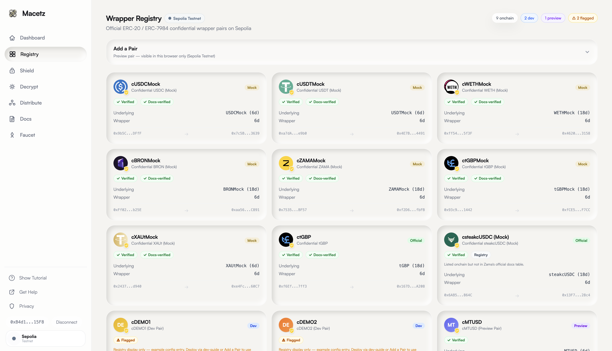

</div>

---

## Table of Contents

- [Overview](#overview)
- [Live Deployment](#live-deployment)
- [Product Demo](#product-demo-gif-walkthrough)
- [Features](#features)
- [Architecture](#architecture)
- [How the Registry is Sourced](#how-the-registry-is-sourced)
- [How to Add a New Pair](#how-to-add-a-new-erc-20--erc-7984-pair)
- [Official Sepolia cTokenMocks](#official-sepolia-ctokenmocks)
- [Technical Deep Dive](#technical-deep-dive)
- [Tech Stack](#tech-stack)
- [Code Quality & Production Readiness](#code-quality--production-readiness)
- [Local Development](#local-development)
- [Deployment](#deployment)
- [Environment Variables](#environment-variables)
- [Bounty Submission Checklist](#bounty-submission-checklist-wrappers-registry-track)
- [Verified On-Chain Evidence](#verified-on-chain-evidence-sepolia)
- [Known Limitations](#known-limitations)

---

## Overview

Today, many developers spin up their own ERC-20 testnet tokens and ERC-7984 wrappers instead of using the ones that already exist in the official Zama Wrappers Registry. This fragments the ecosystem — every team ships against a slightly different set of tokens, integrations don't compose, and users end up with a wallet full of look-alike confidential assets that don't actually interoperate.

**Macetz solves this** by turning the official onchain registry into a complete, production-ready dApp. Every canonical ERC-20 ↔ ERC-7984 pair is easy to find, wrap, unwrap, decrypt, and extend — making the official registry the path of least resistance.

### What makes Macetz different

| Feature | Macetz | Typical DIY dApp |
|---|---|---|
| Registry source | ✅ Onchain canonical registry | ❌ Hardcoded / local only |
| **Dual-network support** | ✅ **Sepolia + Ethereum Mainnet** | ❌ Sepolia-only |
| Pair extensibility | ✅ Hybrid: onchain + local config | ❌ Redeployment required |
| EIP-712 decrypt | ✅ Any ERC-7984, not just registry pairs | ❌ Registry tokens only |
| cTokenMock faucet | ✅ All 7 official Sepolia mocks (public mint) | ❌ Limited / none |
| **Registry integrity checks** | ✅ **Auto-flags anomalies per pair** | ❌ Blind render |
| Error handling | ✅ User-friendly, context-aware messages | ❌ Raw contract reverts |
| UX | ✅ Premium, step-by-step flows | ❌ Minimal |

---

## Live Deployment

| Environment | URL | Network |
|---|---|---|
| **Production** | [https://www.macetz.web.id](https://www.macetz.web.id) | Sepolia + Mainnet |
| **App (dApp)** | [https://www.macetz.web.id/app](https://www.macetz.web.id/app) | Sepolia + Mainnet |
| **Local dev** | `npm run dev` → [http://localhost:3000/app](http://localhost:3000/app) | Sepolia (recommended for judges) |

> **Note for Judges:** Connect MetaMask to **Sepolia** for the full bounty flow (registry → faucet → shield → decrypt → unshield → arbitrary ERC-7984 decrypt). Ethereum mainnet is supported for browse and relayer-dependent shield/decrypt with a real-funds confirmation gate. **Confidential Distribute (TokenOps) is Sepolia-only** — the official disperse singleton is deployed on testnet.
>
> The app is fully self-contained — it can also be run locally in one command (`npm run dev`) or redeployed anywhere with the included `vercel.json`.

---

## Product Demo (GIF Walkthrough)

The complete bounty flow, captured live on Sepolia. Every GIF below maps 1:1 to a hard requirement of the Wrappers Registry bounty.

### 1. Browse the Registry — every onchain pair, badged
Live read of `getTokenConfidentialTokenPairs()` on Sepolia: **✓ Docs-verified** badges, integrity checks, Dev-pair labels, and one-click network switch to Mainnet and back.


### 2. Faucet — all 7 official cTokenMocks in one click
`Mint All` mints every public cTokenMock (cUSDC, cUSDT, cWETH, cBRON, cZAMA, ctGBP, cXAUt mocks) straight from the official Sepolia contracts.
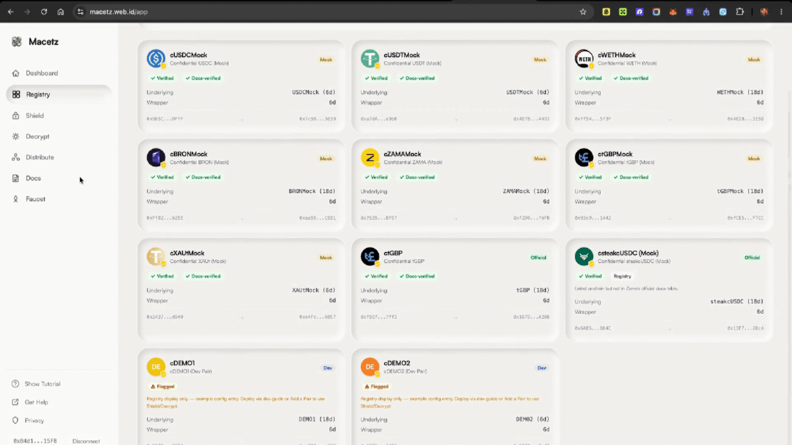

### 3. Shield — ERC-20 → confidential ERC-7984
Auto allowance detection, then a single **Approve & Wrap** with the live step indicator (`Approving → Wrapping → Confirmed`).
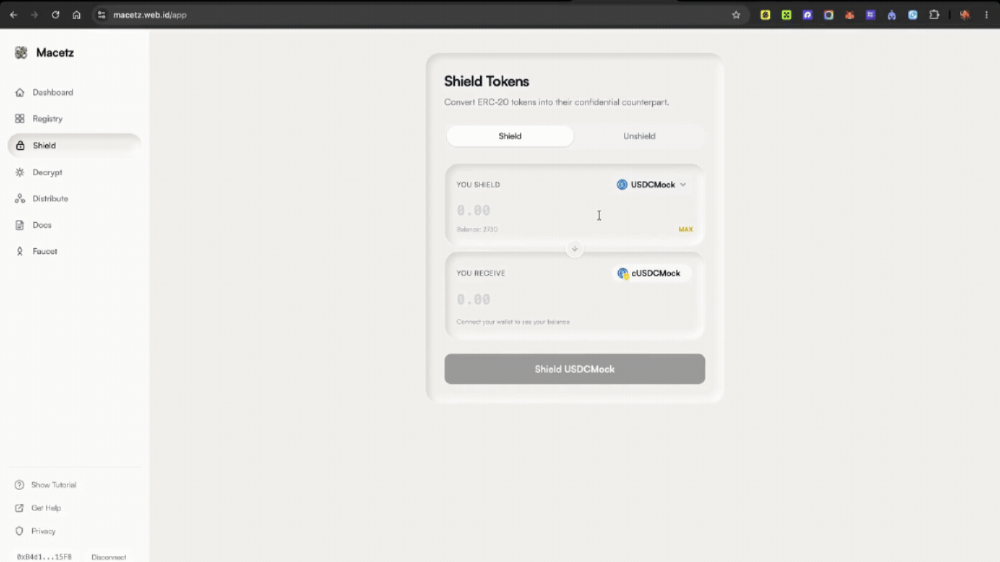

### 4. Decrypt — one EIP-712 signature, your balance only
The encrypted `euint64` balance becomes readable after a single EIP-712 signature. The signature can only ever decrypt the signer's own balance.
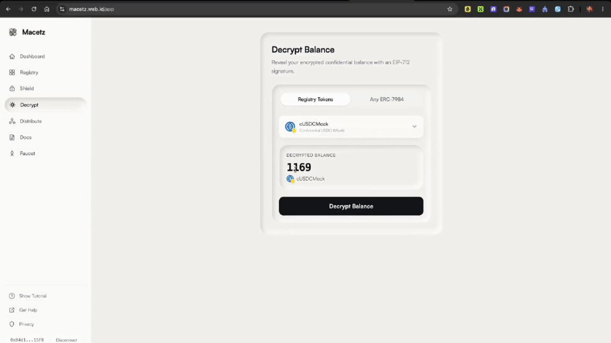

### 5. Unshield — the honest two-phase unwrap
`unwrap()` → Zama relayer decrypts → `finalizeUnwrap()`. The UI shows a real *Pending Finalization* state (~30–90s) instead of faking instant success.
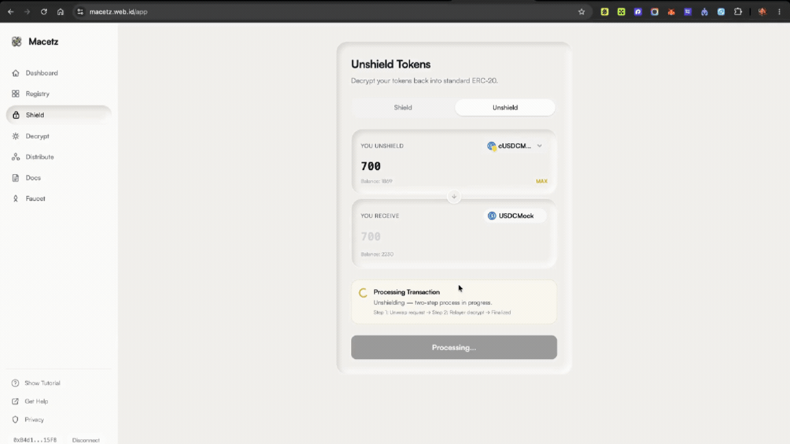

### 6. Universal Decrypt — ANY ERC-7984, not just registry pairs
Paste an arbitrary wrapper address (here: our own `cMTUSD`, deployed via the dev-guide and **not** in the official registry) → validated onchain via ERC-165 → decrypted.
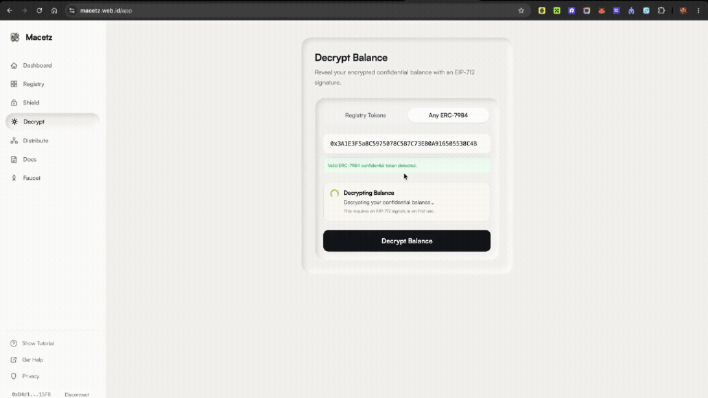

### 7. Add a Pair — extensibility without redeploying
The in-app Admin UI validates a new pair onchain (ERC-165 + decimals), previews it instantly, and emits a copy-paste `custom-pairs.json` snippet.
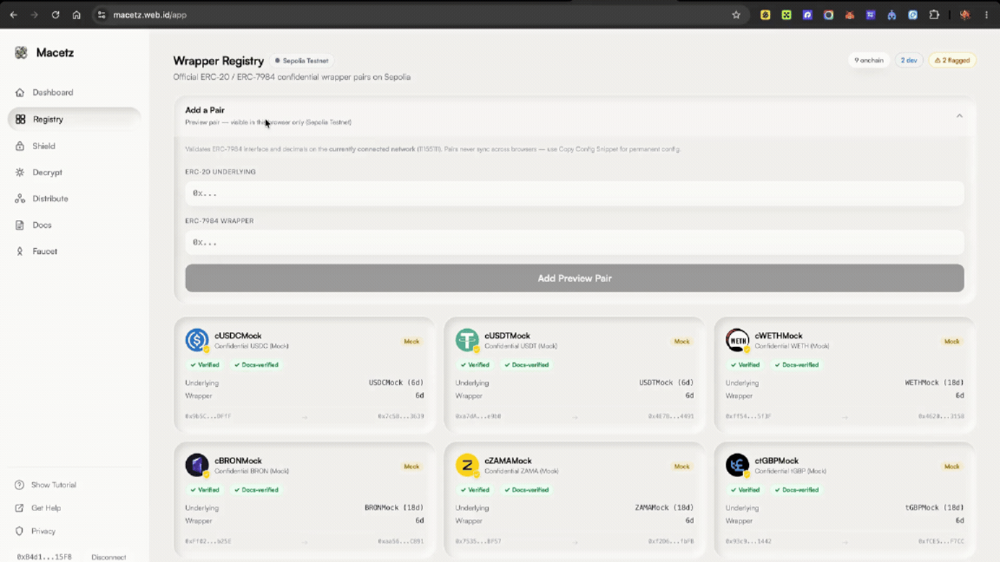

### 8. Confidential Distribution — payroll nobody can read
CSV of recipients in, one TokenOps disperse tx out. Recipients are visible onchain; **amounts never are**. Each recipient decrypts only their own slice.
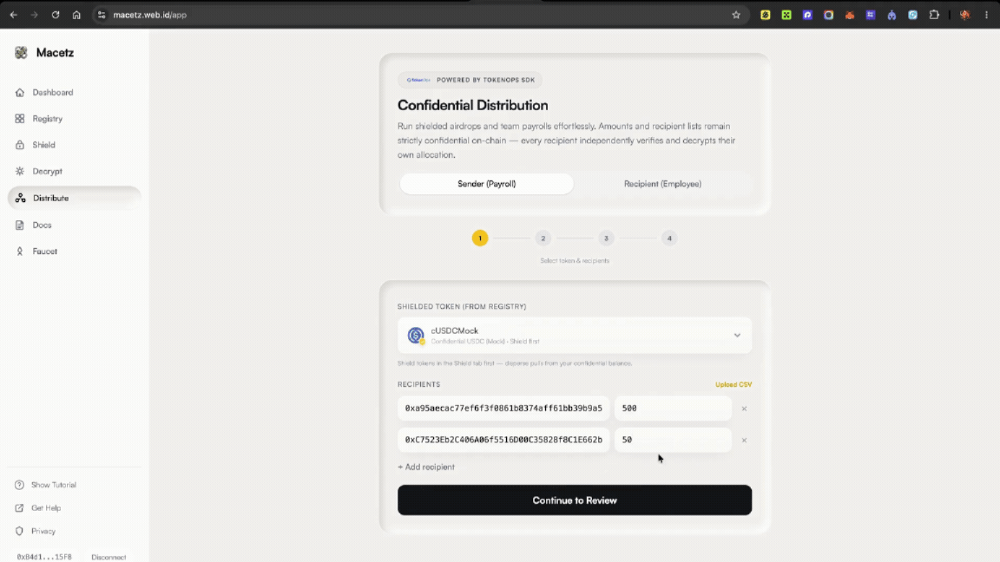

> **Full narrated demo video:** https://youtu.be/IfY9iK8THK8

---

## Dual-Network Support

Macetz is the first Wrappers Registry interface to explicitly support **both** networks listed in Zama's official documentation.

| Chain | Registry Address | Wrapper Pairs | Browse | Decrypt | Wrap/Unwrap | Faucet | Distribute |
|---|---|---|---|---|---|---|---|
| **Sepolia** | `0x2f0750Bb...128e` | 8 docs-listed (7 mocks + ctGBP) | ✅ | ✅ | ✅ | ✅ | ✅ (TokenOps, docs-verified only) |
| **Ethereum Mainnet** | `0xeb5015fF...bBA0` | 9 docs-listed | ✅ | ⚠️ relayer-dependent | ⚠️ relayer-dependent (real-funds confirmation) | ❌ | ❌ |

### Network switching
- A **network switch control** in the sidebar shows the active network with an animated indicator and lets you switch chains with a single click — this triggers a real MetaMask chain-switch request, not a UI state toggle.
- The **Faucet** nav item animates in/out (height + opacity, 0.2s) reactively based on the actual connected `chainId` — visible on Sepolia, removed from the DOM on Mainnet.
- Switching networks automatically reloads the registry from the correct contract address.

### Mainnet real-funds safety
Wrap and unwrap on Ethereum mainnet show an explicit confirmation dialog before any transaction: *"You are about to shield/unshield [amount] [token] on Ethereum mainnet — this uses real funds and cannot be undone."* The user must click "I understand, proceed" to continue. This is exactly the kind of production-conscious UX that *"could a real user trust it today"* implies.

**Mainnet FHE caveat:** Wrap/decrypt on mainnet depend on Zama's mainnet relayer being provisioned (`NEXT_PUBLIC_MAINNET_RELAYER_URL`). Registry browsing works fully; FHE operations may return 403 until the relayer is live.

---

## Registry Integrity Detection

Macetz automatically flags registry anomalies rather than blindly rendering every entry — a feature no known competitor has shipped as a live product feature.

### What is checked (per pair, on every registry load)

| Check | Pass | Flag |
|---|---|---|
| **Wrapper decimals** | ≤ 6 (per Zama ERC-7984 spec) | > 6 decimals |
| **Underlying address** | Valid non-zero address | Zero address |
| **Duplicate detection** | Official + Mock split is expected | Two+ non-Mock-distinguishable entries share a base symbol |

### The Official/Mock distinction matters
Some symbols legitimately have two entries: an official production wrapper (e.g., `ctGBP`) AND a separate Mock testnet-only wrapper (`ctGBPMock`). **Macetz correctly identifies this as intentional design** and does NOT flag it as a duplicate — only genuinely suspicious duplicates (same base symbol, no official/Mock relationship) are flagged.

### Visibility in the UI
- Each pair in the Registry Browser shows a **`✓ Verified`** or **`⚠ Flagged`** integrity badge.
- Registry pairs also show **`✓ Docs-verified`** (wrapper in Zama's official docs table) or a neutral **`Registry`** badge with a caution note when listed onchain but not in the docs allowlist.
- Flagged pairs remain **fully functional** for Shield/Decrypt when `isValid` — not hidden, just clearly marked.
- The Registry header shows a count of flagged pairs and a legend explaining the checks.

---

## Features

### Browse the Registry
- Displays every official ERC-20 ↔ ERC-7984 wrapper pair from the onchain Zama Wrappers Registry
- Shows token metadata: symbol, name, decimals, and both contract addresses with Etherscan links
- **Network-aware**: auto-switches between Sepolia and Mainnet registry contracts based on wallet connection
- **Integrity badges**: each pair shows `✓ Verified` or `⚠ Flagged` based on automatic anomaly checks
- Clearly labels mock (testnet-only) vs. production tokens
- Merges local dev-only pairs with a **"Dev Pair"** badge — `configExample` entries are **registry display only** (not offered in Shield/Decrypt/Distribute until real contracts are deployed)

### Developer-Friendly Onboarding — Guided Tutorial + In-App Docs
Macetz is built to get a developer productive in minutes, not hours:
- **Show Tutorial** — an interactive spotlight tour (triggered from the sidebar, and auto-shown on first visit) walks you through the whole app tab by tab: Faucet → Registry → Shield → Decrypt → Distribute. It highlights each control instead of making you read a manual.
- **In-App Docs** — a sidebar **Docs** tab with a table of contents and copyable code blocks. It covers a full quickstart *from `git clone` to a running app*, all four ways to add a pair, security notes, and the complete `dev-guide/` Hardhat walkthrough to deploy your own confidential token — copy-paste, end to end.
- Docs content is structured data in `src/lib/docs-content.ts` — edit copy without touching layout code.

### SEO-Optimized & Discoverable
- Keyword-rich metadata (title, description, Open Graph, Twitter cards) targeting *Zama faucet*, *Zama wrapper*, *Zama Wrappers Registry*, *ERC-7984*, *confidential token*, *FHE/FHEVM*
- Auto-generated `/sitemap.xml` and `/robots.txt` (Next.js metadata routes) + `WebApplication` JSON-LD structured data for rich results
- Google Search Console verification file served from `public/` — ready to submit the sitemap

### Confidential Distribution (TokenOps — Sepolia)
- 4-step sender wizard: token → recipients (CSV) → preflight review → disperse tx
- Recipient view: detect pending allocations → EIP-712 decrypt own payroll amount
- Uses official TokenOps singleton `0x710dD9885Cc9986EfD234E7719483147a6d8DBb4` on Sepolia

### Wrap (ERC-20 → ERC-7984)
- Auto-detects current ERC-20 allowance before submitting
- One-click "Approve & Wrap" or a clean two-step flow for transparency
- Shows real-time step indicator: `Approving → Wrapping → Confirmed`
- **Mainnet safety**: explicit real-funds confirmation dialog before any mainnet transaction
- Displays updated ERC-7984 balance immediately after wrap

### Unwrap (ERC-7984 → ERC-20)
- Full two-step async unwrap: `unwrap()` → relayer decryption → `finalizeUnwrap()`
- Shows a "Pending Finalization" state with timer and human-readable explanation
- Tracks unwrap request IDs onchain for auditability
- **Mainnet safety**: explicit real-funds confirmation dialog before any mainnet transaction

### Decrypt Balances (Universal)
- Decrypts any ERC-7984 balance via EIP-712 user-decryption
- Works for **any** ERC-7984 contract address — not only registry pairs
- **Works on both networks**: decrypt is read-only/EIP-712 and fully supported on Ethereum mainnet
- Two modes:
  - **Registry mode**: Select from the official pair dropdown
  - **Universal mode**: Paste any address — validated via `supportsInterface(0x4958f2a4)` before attempting decrypt

### Testnet Faucet
- Claims official cTokenMock test tokens (up to 1,000 per mint call)
- Covers all 7 public-mint Sepolia cTokenMocks listed in the Zama docs
- One-click mint with real-time transaction status feedback
- **Mainnet-aware**: Faucet nav item is removed from sidebar on Mainnet (animates out with height + opacity transition); navigating to faucet on Mainnet shows an informational banner instead

---

## Architecture

### System Overview

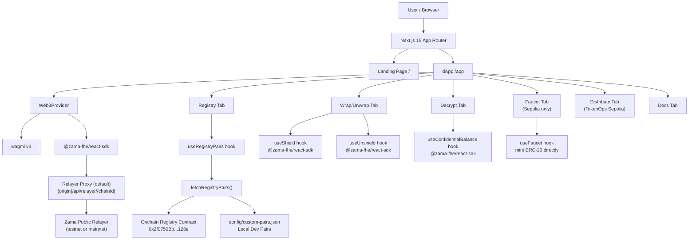

### Directory Structure

```
macetz/
├── src/
│   ├── app/                              # Next.js 15 App Router
│   │   ├── page.tsx                      # Landing page (+ WebApplication JSON-LD)
│   │   ├── layout.tsx                    # Root layout + SEO metadata (OG, Twitter, canonical)
│   │   ├── icon.png                      # Favicon (file-convention)
│   │   ├── robots.ts / sitemap.ts        # Auto-generated /robots.txt + /sitemap.xml
│   │   ├── app/
│   │   │   ├── layout.tsx                # /app metadata + canonical
│   │   │   └── page.tsx                  # dApp shell (tab router)
│   │   └── api/relayer/[...path]/route.ts # Same-origin relayer proxy (Sepolia + Mainnet)
│   ├── components/
│   │   ├── *.tsx                         # Landing-page sections (Hero, Features, Docs sections…)
│   │   └── app/                          # dApp UI (one component per concern)
│   │       ├── Dashboard.tsx             # Network-aware overview + quick actions
│   │       ├── RegistryBrowser.tsx       # Browse pairs, integrity + docs-verified badges
│   │       ├── AddPairSection.tsx        # In-app admin: validate + preview a new pair
│   │       ├── WrapUnwrapPanel.tsx       # Shield / Unshield (two-phase unwrap)
│   │       ├── DecryptPanel.tsx          # Registry + Any-ERC-7984 decrypt
│   │       ├── FaucetPanel.tsx           # cTokenMock mints + Mint All (Sepolia)
│   │       ├── DistributePanel.tsx       # TokenOps confidential payroll wizard
│   │       ├── DocsPanel.tsx             # In-app documentation (copyable code)
│   │       ├── OnboardingTutorial.tsx    # Spotlight guided tour
│   │       ├── NetworkGuard.tsx / NetworkSwitchButton.tsx / MainnetFheBanner.tsx
│   │       └── AppSidebar.tsx / AppHeader.tsx / TokenSelect.tsx / TokenIcon.tsx …
│   ├── hooks/                            # Data layer (React Query)
│   │   ├── useRegistryPairs.ts           # Onchain + custom + preview merge & dedup
│   │   └── useFaucet.ts                  # cTokenMock mint lifecycle
│   ├── lib/                              # Pure logic — no React, unit-testable
│   │   ├── config.ts                     # Registry addresses, KNOWN_MOCK_PAIRS, relayer URLs
│   │   ├── registry.ts                   # Onchain fetch + integrity checks + merge
│   │   ├── pair-utils.ts                 # Operational gates (Shield/Decrypt vs Distribute)
│   │   ├── pair-validation.ts            # Add-Pair on-chain validation (ERC-165 + decimals)
│   │   ├── preview-pairs.ts              # Browser localStorage previews (chain-scoped)
│   │   ├── disperse.ts                   # TokenOps campaign + CSV helpers
│   │   ├── errors.ts                     # Centralized, chain-aware wallet-error formatter
│   │   ├── abis.ts / types.ts / token-icons.ts / docs-content.ts
│   └── providers/Web3Provider.tsx        # wagmi v3 + Zama SDK (shared config, SSR-safe)
├── config/custom-pairs.json              # Chain-keyed dev pairs (`configExample` = display-only)
├── dev-guide/                            # Standalone Hardhat project — deploy your own pair
│   ├── contracts/MacetzConfidentialWrapper.sol
│   ├── scripts/deploy.ts, wrap-and-verify.ts
│   └── deployed-addresses.json           # Real Sepolia deployment record (committed)
├── scripts/
│   ├── verify-distribute.ts              # Offline smoke tests (imports the REAL lib modules)
│   └── sepolia-bounty-e2e.ts             # Reproducible on-chain E2E → README tx hashes
├── .github/workflows/ci.yml              # CI: typecheck + build + tests on every push/PR
├── .npmrc                                # legacy-peer-deps so `npm install` works clean
├── CONTRIBUTING.md · SECURITY.md · LICENSE (BSD-3-Clause-Clear)
└── vercel.json                           # Zero-config deploy
```

### Data Flow

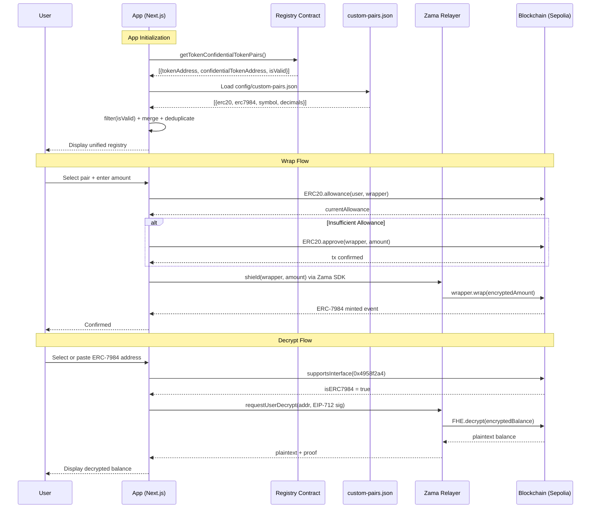

---

## How the Registry is Sourced

Macetz uses a **hybrid registry model** — the onchain registry is always the authoritative source, while a local config allows dev-only extensions without fragmenting the canonical set.

### 1. Primary: Onchain Wrappers Registry

```typescript
// src/lib/registry.ts
export async function fetchRegistryPairs(
  client: PublicClient,
  chainId: number
): Promise<TokenPair[]> {
  const registryAddress = getRegistryAddress(chainId);
  const officialAddresses = getOfficialAddresses(chainId);

  const rawPairs = await client.readContract({
    address: registryAddress,
    abi: REGISTRY_ABI,
    functionName: "getTokenConfidentialTokenPairs",
  });

  // All valid onchain pairs — registry is source of truth
  const validPairs = rawPairs.filter((p) => p.isValid);

  const pairs = await Promise.all(
    validPairs.map(async (raw) => {
      const [erc20Meta, erc7984Meta] = await Promise.all([
        fetchTokenMetadata(client, raw.tokenAddress),
        fetchTokenMetadata(client, raw.confidentialTokenAddress),
      ]);
      const wrapperInDocs = officialAddresses.has(
        raw.confidentialTokenAddress.toLowerCase()
      );
      return {
        erc20Address: raw.tokenAddress,
        erc7984Address: raw.confidentialTokenAddress,
        // ...metadata fields...
        source: "registry" as const,
        isValid: true,
        docsVerified: wrapperInDocs, // badge only — does not filter pairs out
      };
    })
  );

  return runIntegrityChecks(pairs);
}
```

### 2. Secondary: Local Config

```typescript
// src/lib/registry.ts — chain-keyed local config
export function loadCustomPairs(chainId: number): TokenPair[] {
  const config = customPairsJson as CustomPairsConfig;
  const entries = config[String(chainId)] ?? [];
  return entries.map((entry) => mapCustomEntryToPair(entry, "local-dev"));
}
```

Custom pairs are tagged `source: "local-dev"`. Entries with `"configExample": true` (seeded `cDEMO1` / `cDEMO2`) appear in the **Registry** tab only — they are excluded from Shield, Decrypt, and Distribute until replaced with deployed contract addresses.

### Registry Merge Logic

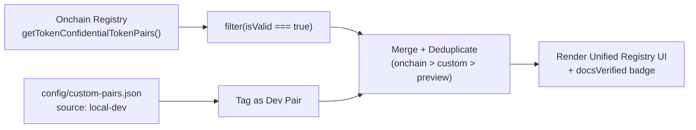

---

## How to Add a New ERC-20 ↔ ERC-7984 Pair

Macetz supports **four paths** for adding pairs:

---

### Path A — Official Registration *(Recommended for Production)*

Submit the pair to the onchain Zama Wrappers Registry. Once registered and `isValid == true`, Macetz will automatically surface it on next load — **zero code changes required**.

```
ConfidentialTokenWrappersRegistry (Sepolia)
0x2f0750Bbb0A246059d80e94c454586a7F27a128e
```

Follow the [Zama Wrappers Registry documentation](https://docs.zama.ai) for the registration process.

---

### Path B — Local Config *(For Dev / Prototyping)*

Ideal for developers iterating on new ERC-7984 tokens before official registration.

**Live reference:** open the Registry tab on Sepolia — you'll see pre-seeded **config examples** tagged **Dev** (`cDEMO1`, `cDEMO2`). These illustrate the JSON schema only; they are **not** deployed contracts and cannot be wrapped or decrypted.

**Step 1:** Open `config/custom-pairs.json`

**Step 2:** Add your entry under the correct chain key (`"11155111"` for Sepolia, `"1"` for Mainnet):

```json
{
  "11155111": [
    {
      "erc20": "0xYourUnderlyingERC20Address",
      "erc7984": "0xYourERC7984WrapperAddress",
      "symbol": "cMYTOKEN",
      "decimals": 18,
      "source": "local-dev"
    }
  ],
  "1": []
}
```

| Field | Type | Required | Description |
|---|---|---|---|
| `erc20` | `address` | ✅ | Underlying ERC-20 address on the target network |
| `erc7984` | `address` | ✅ | ERC-7984 wrapper address on the target network |
| `symbol` | `string` | ✅ | Ticker for the wrapper token (prefix with `c`) |
| `decimals` | `number` | ✅ | ERC-20 decimals (max 18; wrapper auto-caps at 6) |
| `source` | `"local-dev"` | ✅ | Must always be `"local-dev"` |
| `configExample` | `boolean` | Optional | When `true`, pair is registry display-only (no Shield/Decrypt/Distribute) |

**Step 3:** Restart dev server. Pair shows with **Dev** badge.

### Path C — In-App Admin UI *(Interactive extensibility demo)*

1. Open **Registry → Add a Pair**
2. Paste ERC-20 + ERC-7984 addresses (validated on the **currently connected network**)
3. Pair appears instantly as **Preview** — browser-only, chain-scoped in `localStorage`
4. Click **Copy Config Snippet** to paste into `custom-pairs.json` for a permanent entry

Works on **both Sepolia and Mainnet** — preview pairs never leak across networks.

### Path D — Deploy your own pair (`dev-guide/`)

Cross-platform Hardhat guide (macOS + Windows): [`dev-guide/README.md`](./dev-guide/README.md).  
`npm run deploy:sepolia` → paste addresses into Path B or Path C.

> **Security note:** Local-dev and preview pairs are visually separated from canonical on-chain registry pairs.

---

## Official Sepolia cTokenMocks

All 8 official Sepolia confidential wrappers from the Zama docs are hardcoded in `src/lib/config.ts` (7 mocks + ctGBP). The Faucet tab shows the 7 public-mint mocks only:

| Symbol | ERC-7984 Wrapper | Underlying ERC-20 | Faucet |
|--------|-----------------|-------------------|--------|
| **cUSDCMock** | [0x7c5BF43...3639](https://sepolia.etherscan.io/address/0x7c5BF43B851c1dff1a4feE8dB225b87f2C223639) | [0x9b5Cd1...fF](https://sepolia.etherscan.io/address/0x9b5Cd13b8eFbB58Dc25A05CF411D8056058aDFfF) | ✅ Public |
| **cUSDTMock** | [0x4E7B06...491](https://sepolia.etherscan.io/address/0x4E7B06D78965594eB5EF5414c357ca21E1554491) | [0xa7dA08...b0](https://sepolia.etherscan.io/address/0xa7dA08FafDC9097Cc0E7D4f113A61e31d7e8e9b0) | ✅ Public |
| **cWETHMock** | [0x46208...158](https://sepolia.etherscan.io/address/0x46208622DA27d91db4f0393733C8BA082ed83158) | [0xff5473...3F](https://sepolia.etherscan.io/address/0xff54739b16576FA5402F211D0b938469Ab9A5f3F) | ✅ Public |
| **cBRONMock** | [0xaa5612...891](https://sepolia.etherscan.io/address/0xaa5612FA27c927a0c7961f5AEFEE5ba3A0F9C891) | [0xFf021f...5E](https://sepolia.etherscan.io/address/0xFf021fB13cA64e5354c62c954b949a88cfDEb25E) | ✅ Public |
| **cZAMAMock** | [0xf2D628...bFB](https://sepolia.etherscan.io/address/0xf2D628d2598aF4eAF94CB76a437Ff86CA78FfbFB) | [0x75355a...57](https://sepolia.etherscan.io/address/0x75355a85c6FB9df5f0C80FF54e8747EEe9a0BF57) | ✅ Public |
| **ctGBPMock** | [0xfCE5c7...7CC](https://sepolia.etherscan.io/address/0xfCE5c7069c5525eF6c8C2b2E35A745bA20a2F7CC) | [0x93c931...42](https://sepolia.etherscan.io/address/0x93c931278A2aad1916783F952f94276eA5111442) | ✅ Public |
| **cXAUtMock** | [0xe4FcF8...0C7](https://sepolia.etherscan.io/address/0xe4FcF848739845BC81Dee1d5352cf3844F0a60C7) | [0x24377A...40](https://sepolia.etherscan.io/address/0x24377AE4AA0C45ecEe71225007f17c5D423dd940) | ✅ Public |
| **ctGBP** | [0x167DC9...208](https://sepolia.etherscan.io/address/0x167DC962808B32CFFFc7e14B5018c0bE06A3A208) | [0xf6Ef9A...f3](https://sepolia.etherscan.io/address/0xf6Ef9ADB61A48E29E36bc873070A46A3D2667ff3) | ⚠️ Restricted |

---

## Technical Deep Dive

### Wrap Flow (ERC-20 → ERC-7984)

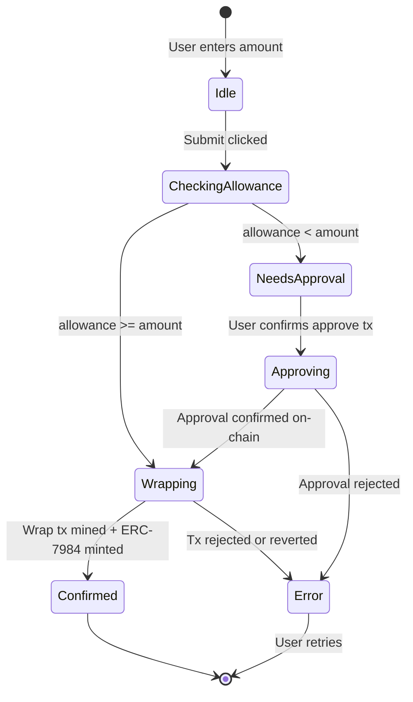

**Key implementation details:**

1. **Allowance check** — `ERC20.allowance(user, wrapperAddress)` via `viem readContract`
2. **ERC-20 Approve** — `ERC20.approve(wrapperAddress, rawAmount)` standard tx
3. **Shield / Wrap** — `useShield()` from `@zama-fhe/react-sdk` encrypts the amount client-side with TFHE and calls `wrapper.wrap(encryptedInput)` via the Zama SDK
4. **Rate conversion** — `wrapper.rate()` converts between ERC-20 raw units and the 6-decimal encrypted ERC-7984 representation

### Unwrap Flow (ERC-7984 → ERC-20)

Unwrapping requires the Zama relayer to publicly decrypt the amount before the ERC-20 can be transferred back:

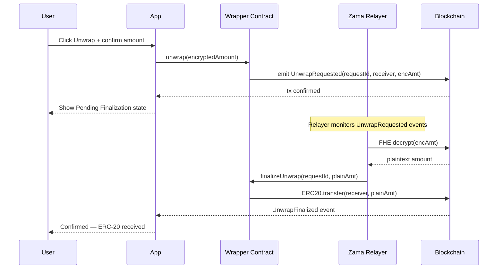

The UI shows a two-phase state machine: `requesting` → `pending-finalization` (~30–90s) → `confirmed`, with a clear explanation of why finalization takes time.

### EIP-712 User-Decryption Flow

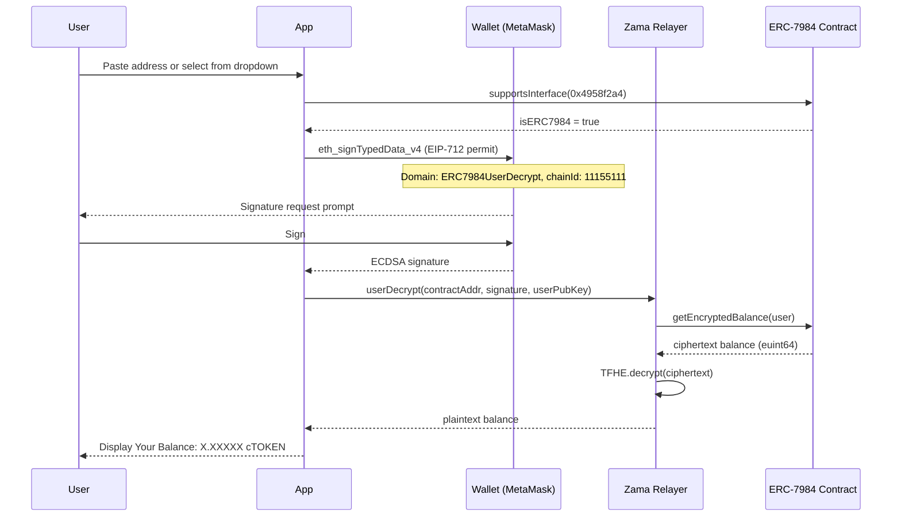

The EIP-712 signature authorizes the relayer to decrypt **only the signing user's balance** — it is impossible to decrypt another user's balance with this flow.

### Error Handling

Every wallet interaction routes through a centralized error formatter in `src/lib/errors.ts`:

```typescript
export function formatWalletError(error: unknown, chainId?: number): string {
  const msg = (error instanceof Error ? error.message : String(error)).toLowerCase();

  if (msg.includes("user rejected") || msg.includes("user denied"))
    return "Transaction rejected by user.";
  if (msg.includes("wrong network") || msg.includes("chain mismatch"))
    return chainId === 1
      ? "Please switch to Ethereum mainnet to continue."
      : "Please switch to Sepolia testnet to continue.";
  if (msg.includes("gas"))
    return chainId === 1
      ? "Transaction requires more gas. Ensure you have enough ETH."
      : "Transaction requires more gas. Ensure you have enough Sepolia ETH.";
  // ...additional mappings...
}
```

| Failure Scenario | User-Facing Message |
|---|---|
| User cancels MetaMask prompt | "Transaction rejected by user." |
| Insufficient ERC-20 balance | "Insufficient balance for this transaction." |
| Missing ERC-20 allowance | "Token approval required. Please approve first." |
| Wrong network connected | "Please switch to Sepolia testnet to continue." |
| Not an ERC-7984 address | "This address does not support ERC-7984 decryption." |
| Gas estimation failure | "Ensure you have enough Sepolia ETH." |
| Contract reverts | "The contract rejected this operation." |
| Relayer timeout | "Transaction timed out. Please check your wallet." |

---

## Tech Stack

| Layer | Technology | Version | Purpose |
|---|---|---|---|
| **Framework** | Next.js | 15 (App Router) | SSR, API routes, file routing |
| **Language** | TypeScript | 5.x (strict) | Full type safety across all modules |
| **Styling** | Tailwind CSS | v4 | Utility-first, responsive styling |
| **Animation** | Motion (Framer Motion) | v12 | Scroll reveals, micro-interactions |
| **Web3 State** | wagmi | v3 | Wallet connection, tx lifecycle |
| **EVM Client** | viem | v2 | Type-safe contract reads + writes |
| **FHE React SDK** | @zama-fhe/react-sdk | v3 | useShield, useUnshield, useConfidentialBalance |
| **FHE Core** | @zama-fhe/sdk | v3 | TFHE encryption primitives |
| **Data Fetching** | TanStack React Query | v5 | Server state, smart caching |
| **Wallet Support** | @wagmi/connectors | v8 | MetaMask, WalletConnect v2 |

---

## Code Quality & Production Readiness

Macetz is written to be judged as a product, not a prototype.

### Architecture & code quality
- **Strict separation of concerns.** `lib/` holds pure, React-free logic (registry fetch, integrity checks, pair gating, error formatting) that is directly unit-testable; `hooks/` is the data layer (React Query); `components/` is presentation only. One component per concern.
- **TypeScript strict mode, zero type errors.** `npm run lint` (`tsc --noEmit`) is clean; the build fails on any type error.
- **Minimal trusted surface.** There is **no custom application contract** — all FHE cryptography is delegated to the official, audited `@zama-fhe/*` SDKs and the TokenOps singleton. Less bespoke crypto means less to get wrong.
- **Single source of truth for config.** Registry addresses, known pairs, and relayer URLs all live in `lib/config.ts`, keyed by `chainId`; nothing network-specific is hardcoded in components.
- **Centralized, chain-aware error handling.** Every wallet interaction routes through `lib/errors.ts`, which maps raw reverts to human messages and adapts wording to the connected network.

### Testing & CI
- **CI on every push and PR** ([`.github/workflows/ci.yml`](./.github/workflows/ci.yml)): `npm ci` → typecheck → production build → smoke tests. Nothing merges red.
- **Tests exercise the real modules.** `scripts/verify-distribute.ts` imports the actual `registry.ts` / `pair-utils.ts` / `disperse.ts` / `errors.ts` (not copies) and asserts registry merge/dedup, integrity checks, docs-verified gating, and chain-aware errors — 21 assertions, offline, wallet-free.
- **Reproducible on-chain proof.** `scripts/sepolia-bounty-e2e.ts` runs the full flow on Sepolia and emits the exact transaction hashes published in the [Verified On-Chain Evidence](#verified-on-chain-evidence-sepolia) table. Claims are clickable, not asserted.

### Production hardening
- **SSR-safe.** Client-only signals (`window`, `sessionStorage`, `chainId`) are read behind mount/effect guards to avoid hydration mismatches; the Zama config is built in an effect, never at module init.
- **Stateless & backend-free.** All FHE runs client-side; the only server surface is a thin same-origin relayer proxy (`/api/relayer/<chainId>`) that forwards requests and injects no secrets.
- **Real-funds safety.** Mainnet shield/unshield sit behind an explicit confirmation gate, and mainnet FHE is honestly labeled relayer-dependent rather than overclaimed.
- **Secret hygiene.** No secrets in the repo; the optional deployer key (`dev-guide/.env`) is git-ignored. Environment is `.env.example`-documented and fully optional (sane public defaults).
- **Registry integrity checks** on every load (decimals, zero-address, suspicious duplicates) surface bad data instead of blindly rendering it.
- **Zero-config deploy** via `vercel.json`; discoverable out of the box (sitemap, robots, canonical, JSON-LD, favicon).

---

## Local Development

### Prerequisites

- Node.js ≥ 20.x
- A wallet with Sepolia ETH (faucet: https://sepoliafaucet.com)
- Sepolia RPC URL (Alchemy, Infura, or use the default public node)

### Setup

```bash
# 1. Clone the repository
git clone https://github.com/pramadanif/macetz.git
cd macetz

# 2. Install dependencies
# (the repo-level .npmrc sets legacy-peer-deps for the TokenOps SDK,
# so a plain npm install works out of the box)
npm install

# 3. Configure environment variables
cp .env.example .env.local
# Edit .env.local (see Environment Variables section below)

# 4. Start the development server
npm run dev
# Landing: http://localhost:3000
# dApp:    http://localhost:3000/app
```

### Type Checking

```bash
# TypeScript strict mode — zero type errors expected
npm run lint
```

### Production Build

```bash
npm run build
npm run start
```

---

## Deployment

### Vercel (Recommended)

```bash
# One-command deploy
npx vercel --prod
```

No backend is required. All FHEVM operations run client-side via the Zama SDK. By default the client routes relayer traffic through the same-origin Next.js proxy at `/api/relayer/<chainId>` (built from `window.location.origin`). Override with `NEXT_PUBLIC_RELAYER_URL` / `NEXT_PUBLIC_MAINNET_RELAYER_URL` to hit Zama relayers directly.

### Environment Variables (Vercel Dashboard)

Set these in your Vercel project settings under **Settings → Environment Variables**:

```
NEXT_PUBLIC_RPC_URL=https://eth-sepolia.g.alchemy.com/v2/YOUR_KEY
NEXT_PUBLIC_WALLETCONNECT_PROJECT_ID=your_wc_project_id
# Optional — unset uses same-origin proxy automatically in the browser
# NEXT_PUBLIC_RELAYER_URL=https://your-app.vercel.app/api/relayer/11155111
```

---

## Environment Variables

| Variable | Required | Default | Description |
|---|---|---|---|
| `NEXT_PUBLIC_RPC_URL` | Optional | Public Sepolia node | Sepolia JSON-RPC endpoint |
| `NEXT_PUBLIC_MAINNET_RPC_URL` | Optional | Public mainnet node | Mainnet JSON-RPC endpoint |
| `NEXT_PUBLIC_WALLETCONNECT_PROJECT_ID` | Optional | `""` | Enables WalletConnect modal |
| `NEXT_PUBLIC_RELAYER_URL` | Optional | Same-origin `/api/relayer/11155111` in browser | Override Sepolia relayer URL (absolute http(s)) |
| `NEXT_PUBLIC_MAINNET_RELAYER_URL` | Optional | Same-origin `/api/relayer/1` proxy | Override mainnet relayer URL (mainnet FHE ops are relayer-dependent) |

Copy `.env.example` to `.env.local` to get started:

```bash
# .env.example

# Sepolia RPC (Alchemy, Infura, or public node)
NEXT_PUBLIC_RPC_URL=https://ethereum-sepolia-rpc.publicnode.com

# WalletConnect Project ID — get one at cloud.walletconnect.com
NEXT_PUBLIC_WALLETCONNECT_PROJECT_ID=

# Sepolia relayer — unset = same-origin proxy in browser ({origin}/api/relayer/11155111)
# NEXT_PUBLIC_RELAYER_URL=https://your-app.vercel.app/api/relayer/11155111

# Mainnet relayer — unset = same-origin proxy; upstream may 403 until Zama provisions mainnet
# NEXT_PUBLIC_MAINNET_RELAYER_URL=https://your-app.vercel.app/api/relayer/1
```

---

## Special Bounty Track — Confidential Payroll (TokenOps)

Macetz integrates **TokenOps Confidential Disperse** (`@tokenops/sdk/fhe-disperse`) in the same app as the Wrappers Registry bounty — no separate deployment.

### Use case

**Corporate payroll on Sepolia:** HR shields USDC (or any registry mock), batches encrypted salaries to employee wallets in one transaction. Each employee decrypts only their own allocation via EIP-712. Third parties see recipients but not individual amounts.

### Smart contract layer (for judges)

There is **no custom disperse contract in this repo.** The app calls the official TokenOps singleton via SDK:

| Network | DisperseConfidential Singleton |
|---------|-------------------------------|
| Sepolia | `0x710dD9885Cc9986EfD234E7719483147a6d8DBb4` |

Campaign clones are not used for disperse — the singleton + SDK `useDisperse` handles encryption, ACL grants, and `confidentialTransferFrom` in one tx (`mode: "direct"`).

### Distribute tab flows (Sepolia only)

1. **Sender wizard (4 steps):** Select **docs-verified** operational shielded token → Review preflight (`usePreflightDisperse`) → Approve singleton operator + `useDisperse` tx → Track claim status (pending/claimed via `confidentialBalanceOf` — amounts never shown to third parties)
2. **Recipient view:** Scan operational registry tokens for pending handles → **Decrypt & Claim** via EIP-712
3. **CSV upload:** `address,amount` per line for payroll imports
4. **Mainnet:** informational banner — disperse singleton is Sepolia-only

**Payroll safety:** Distribute (`isDistributeOperationalPair`) requires `docsVerified === true` for onchain registry pairs. Non-docs onchain pairs remain usable in Shield/Decrypt.

Autonomous smoke tests: `npm run verify:distribute`

### TokenOps SDK wiring

```bash
npm install @tokenops/sdk --legacy-peer-deps
```

Encryptor uses the live Zama relayer from `@zama-fhe/react-sdk` (`useZamaSDK().relayer`), forwarded lazily into `useDisperse({ encryptor: () => relayer })` per TokenOps docs.

---

## Bounty Submission Checklist (Wrappers Registry Track)

| Requirement | Status | Where |
|---|---|---|
| Public GitHub repo | ✅ | This repository |
| Live URL (wallet connect) | ✅ https://www.macetz.web.id <!-- HUMAN: verify this URL is live before submitting --> | [Live Deployment](#live-deployment) |
| Sepolia: browse registry | ✅ | Registry tab — all valid onchain pairs + docs-verified badge |
| Sepolia: all 7 cTokenMock faucet mints | ✅ | Faucet tab — `KNOWN_MOCK_PAIRS` + Mint All |
| Sepolia: wrap / unwrap every registry pair | ✅ | Shield tab — `useShield` / `useUnshield` |
| Sepolia: decrypt registry + arbitrary ERC-7984 | ✅ | Decrypt tab — Registry + Any ERC-7984 modes |
| Hybrid registry (onchain + local config) | ✅ | `registry.ts` + `custom-pairs.json` + Admin UI |
| Documented add-pair process (4 paths) | ✅ | README + in-app Docs + `dev-guide/` |
| EIP-712 user-decryption | ✅ | `@zama-fhe/react-sdk` `useConfidentialBalance` |
| Relayer SDK integration | ✅ | `Web3Provider` defaults to `/api/relayer/<chainId>` proxy |
| Error handling (approval, balance, network) | ✅ | `src/lib/errors.ts` + UI guards |
| Demo video | ✅ [youtu.be/IfY9iK8THK8](https://youtu.be/IfY9iK8THK8) | Full narrated walkthrough |
| X thread | 🔲 Submitter delivers | — |

**Judge quick path (Sepolia):** Faucet mint `cUSDCMock` → Shield wrap → Decrypt balance → Unshield → Decrypt tab paste arbitrary wrapper from `dev-guide` deploy.

Run automated checks: `npm run verify`

---

## Verified On-Chain Evidence (Sepolia)

Every hash below was produced by the reproducible E2E script [`scripts/sepolia-bounty-e2e.ts`](./scripts/sepolia-bounty-e2e.ts) (run it with your own funded key to regenerate). The dev-guide deployment record lives in [`dev-guide/deployed-addresses.json`](./dev-guide/deployed-addresses.json).

| Action | Tx hash / address | Etherscan |
|---|---|---|
| Faucet mint (cUSDCMock) | [`0x587c256bf57262a1f355aa724dcd1f115f0314a99c9954cc7a281b724c96da9b`](https://sepolia.etherscan.io/tx/0x587c256bf57262a1f355aa724dcd1f115f0314a99c9954cc7a281b724c96da9b) | [View](https://sepolia.etherscan.io/tx/0x587c256bf57262a1f355aa724dcd1f115f0314a99c9954cc7a281b724c96da9b) |
| Wrap (shield cUSDCMock) | [`0xa17bdde962fcddcc9a63310110714ad846d3e36982782740339a4e51fc0fd6ac`](https://sepolia.etherscan.io/tx/0xa17bdde962fcddcc9a63310110714ad846d3e36982782740339a4e51fc0fd6ac) | [View](https://sepolia.etherscan.io/tx/0xa17bdde962fcddcc9a63310110714ad846d3e36982782740339a4e51fc0fd6ac) |
| Decrypt balance | EIP-712 relayer (no on-chain tx) — cUSDCMock + cMTUSD verified 2026-07-07 | — |
| Unwrap (unshield phase 1) | [`0x8d90e5c42548484d9e55abe2c2be6b97b23973211402a902fe3f9e4f13e7069f`](https://sepolia.etherscan.io/tx/0x8d90e5c42548484d9e55abe2c2be6b97b23973211402a902fe3f9e4f13e7069f) | [View](https://sepolia.etherscan.io/tx/0x8d90e5c42548484d9e55abe2c2be6b97b23973211402a902fe3f9e4f13e7069f) |
| Unwrap finalize (phase 2) | [`0xc6101c96c5c6ed3751b6586cad8f848ea64c9d5934142e6959da3ffa42889d65`](https://sepolia.etherscan.io/tx/0xc6101c96c5c6ed3751b6586cad8f848ea64c9d5934142e6959da3ffa42889d65) | [View](https://sepolia.etherscan.io/tx/0xc6101c96c5c6ed3751b6586cad8f848ea64c9d5934142e6959da3ffa42889d65) |
| TokenOps disperse | [`0x41d71ac3f1d8f701f9a85d8d0a3d4b58bae1ba238a6d0fae7ce1d16c3f74f9d1`](https://sepolia.etherscan.io/tx/0x41d71ac3f1d8f701f9a85d8d0a3d4b58bae1ba238a6d0fae7ce1d16c3f74f9d1) | [View](https://sepolia.etherscan.io/tx/0x41d71ac3f1d8f701f9a85d8d0a3d4b58bae1ba238a6d0fae7ce1d16c3f74f9d1) |
| dev-guide deploy (MTUSD) | ERC-20 [`0x022D67AeE3a5f841CC0c422F0B849B366f2c59B7`](https://sepolia.etherscan.io/address/0x022D67AeE3a5f841CC0c422F0B849B366f2c59B7) | [View](https://sepolia.etherscan.io/address/0x022D67AeE3a5f841CC0c422F0B849B366f2c59B7) |
| dev-guide deploy (cMTUSD) | Wrapper [`0x3A1E3F5a8C5975078C587C73E80A916505538C4B`](https://sepolia.etherscan.io/address/0x3A1E3F5a8C5975078C587C73E80A916505538C4B) | [View](https://sepolia.etherscan.io/address/0x3A1E3F5a8C5975078C587C73E80A916505538C4B) |
| dev-guide deployer | [`0xB4d186aF4d691dE665a36BDA1104067e069a15F8`](https://sepolia.etherscan.io/address/0xB4d186aF4d691dE665a36BDA1104067e069a15F8) | [View](https://sepolia.etherscan.io/address/0xB4d186aF4d691dE665a36BDA1104067e069a15F8) |
| dev-guide wrap tx | [`0xd767600c0d9e96f2c173d8c0b2596c57d5715c7ef31d685f969712303f52e976`](https://sepolia.etherscan.io/tx/0xd767600c0d9e96f2c173d8c0b2596c57d5715c7ef31d685f969712303f52e976) | [View](https://sepolia.etherscan.io/tx/0xd767600c0d9e96f2c173d8c0b2596c57d5715c7ef31d685f969712303f52e976) |

---

## Known Limitations

- **Bounty E2E on Sepolia** — Full wrap/unwrap/faucet/distribute flow is validated on Sepolia testnet. Mainnet supports registry browse; shield/decrypt are relayer-dependent and may fail until Zama provisions the mainnet relayer.
- **Config examples** — `configExample: true` dev pairs are registry display-only until replaced with deployed addresses
- **Single-token batches** — TokenOps Distribute processes one confidential token per payroll run
- **Injected wallet** — Requires MetaMask or any EIP-1193 wallet
- **Relayer latency** — Unwrap finalization depends on Zama's relayer (~30–90s on Sepolia)
- **Unaudited** — Community project for the Zama Developer Program; do not use with real funds

---

## Contributing

Contributions are welcome. Please read [CONTRIBUTING.md](./CONTRIBUTING.md) for
the development setup, the checks your PR must pass (`npm run verify`), and the
pull-request guidelines. Bug reports and feature ideas belong in
[GitHub Issues](https://github.com/pramadanif/macetz/issues).

## Continuous Integration

Every push and pull request to `main` runs the
[CI workflow](./.github/workflows/ci.yml) on GitHub Actions: TypeScript
typecheck (`tsc --noEmit`), a production `next build`, and the registry /
distribute / error-handling smoke tests (`npm run verify:distribute`). The build
must be green before anything is merged.

## Security

Macetz is **unaudited** and built for testnet use — do not use it with real
funds you cannot afford to lose. To report a vulnerability, follow the
[Security Policy](./SECURITY.md) and use GitHub's private vulnerability
reporting rather than a public issue.

## Support

- Issues and questions: [GitHub Issues](https://github.com/pramadanif/macetz/issues)
- Zama protocol, FHEVM, and SDK docs: [docs.zama.ai](https://docs.zama.ai)
- Zama community: [Zama Discord](https://discord.gg/zama) · [@zama on X](https://x.com/zama)

## License

Macetz is released under the [BSD 3-Clause Clear License](./LICENSE) — the same license Zama uses for FHEVM.

This project builds on Zama's FHEVM stack and the `@zama-fhe/*` SDKs, and on the
TokenOps `@tokenops/sdk` — each retains its own license. The example contracts
in `dev-guide/` use Zama and OpenZeppelin confidential-contracts libraries under
their respective licenses.

---

<div align="center">

**Built for the Zama Ecosystem**

[Live Demo](https://www.macetz.web.id) · [Demo Video](https://youtu.be/IfY9iK8THK8) · [GitHub](https://github.com/pramadanif/macetz) · [Zama Docs](https://docs.zama.ai)

</div>
