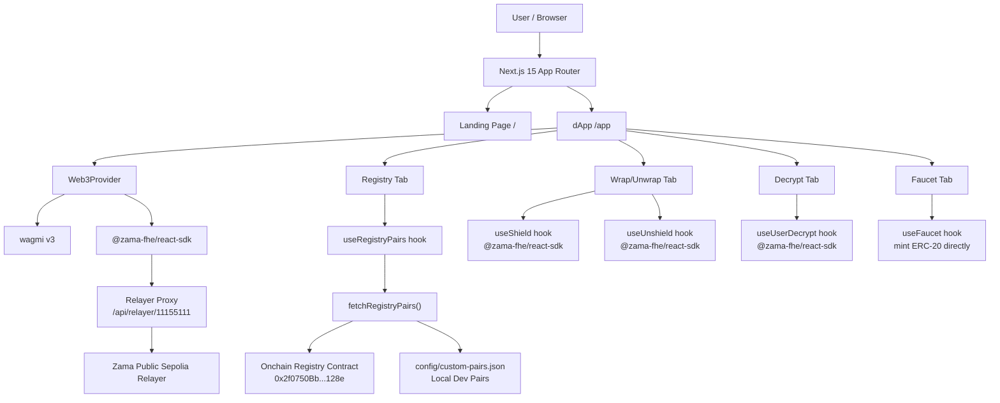
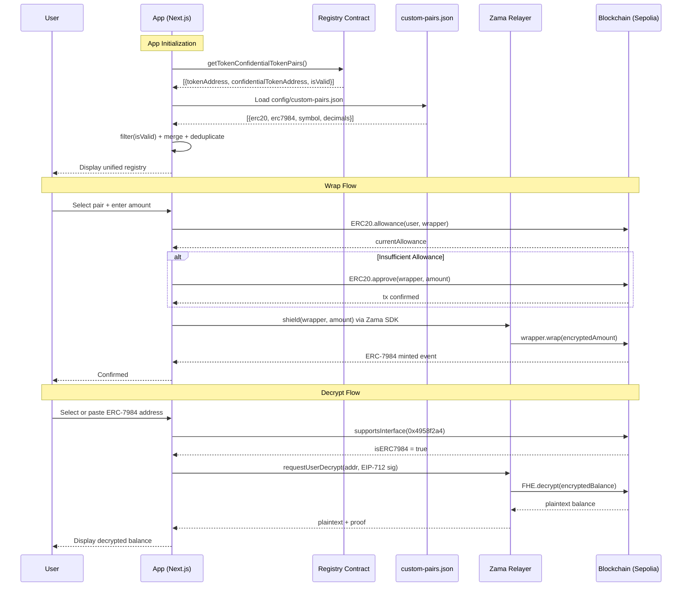
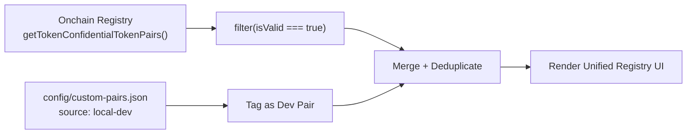
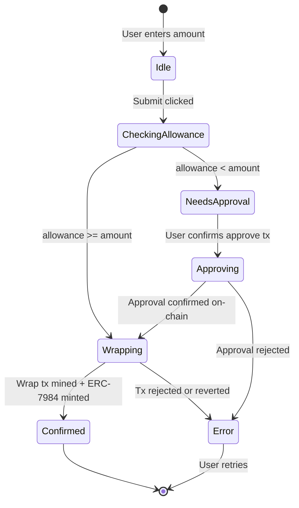
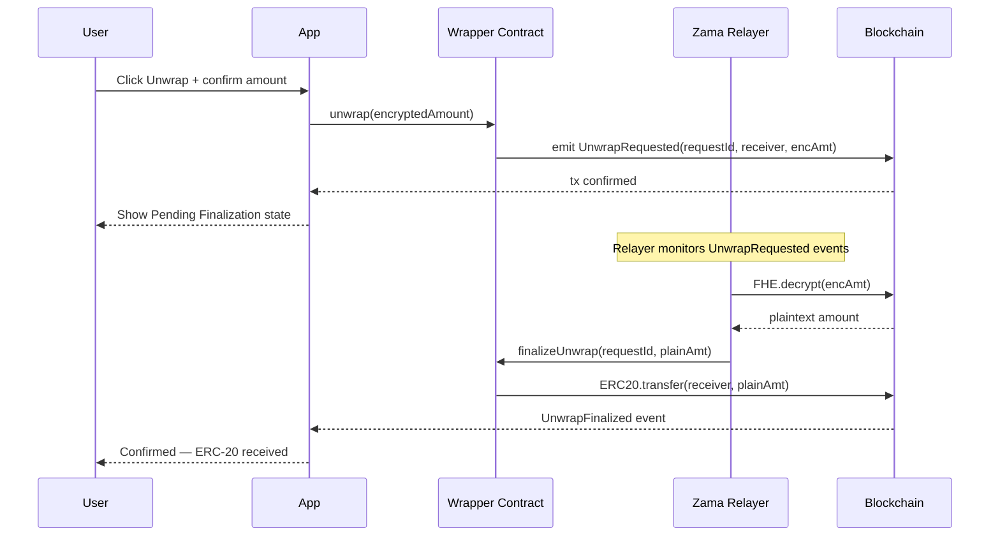
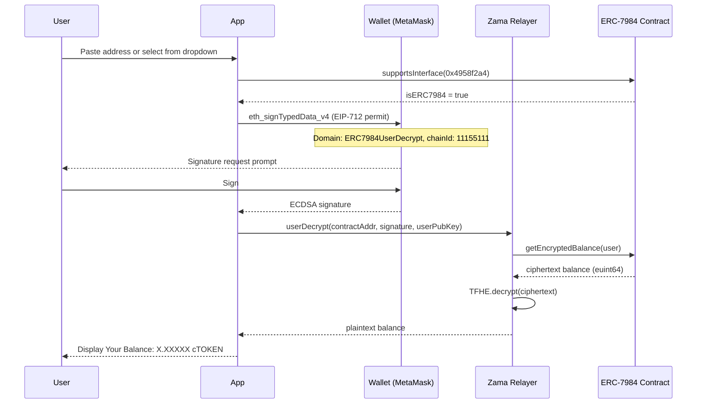

<div align="center">

# 🔐 Macetz — The Confidential Wrapper Registry

**The canonical interface for the Zama Wrappers Registry.**  
Browse, wrap, unwrap, and decrypt ERC-7984 confidential tokens with zero friction.

[](https://macetz.vercel.app)
[](https://etherscan.io)
[](./LICENSE)
[](https://www.zama.ai)
[](https://www.typescriptlang.org)

---

*Built for the Zama Developer Program — Season 3 · Wrappers Registry Bounty Track*

</div>

---

## 📋 Table of Contents

- [Overview](#-overview)
- [Live Deployment](#-live-deployment)
- [Features](#-features)
- [Architecture](#-architecture)
- [How the Registry is Sourced](#-how-the-registry-is-sourced)
- [How to Add a New Pair](#-how-to-add-a-new-erc-20--erc-7984-pair)
- [Official Sepolia cTokenMocks](#-official-sepolia-ctokenmocks)
- [Technical Deep Dive](#-technical-deep-dive)
- [Tech Stack](#-tech-stack)
- [Local Development](#-local-development)
- [Deployment](#-deployment)
- [Environment Variables](#-environment-variables)
- [Known Limitations](#-known-limitations)

---

## 🎯 Overview

Today, many developers spin up their own ERC-20 testnet tokens and ERC-7984 wrappers instead of using the ones that already exist in the official Zama Wrappers Registry. This fragments the ecosystem — every team ships against a slightly different set of tokens, integrations don't compose, and users end up with a wallet full of look-alike confidential assets that don't actually interoperate.

**Macetz solves this** by turning the official onchain registry into a complete, production-ready dApp. Every canonical ERC-20 ↔ ERC-7984 pair is easy to find, wrap, unwrap, decrypt, and extend — making the official registry the path of least resistance.

### What makes Macetz different

| Feature | Macetz | Typical DIY dApp |
|---|---|---|
| Registry source | ✅ Onchain canonical registry | ❌ Hardcoded / local only |
| **Dual-network support** | ✅ **Sepolia + Ethereum Mainnet** | ❌ Sepolia-only |
| Pair extensibility | ✅ Hybrid: onchain + local config | ❌ Redeployment required |
| EIP-712 decrypt | ✅ Any ERC-7984, not just registry pairs | ❌ Registry tokens only |
| cTokenMock faucet | ✅ All 7 official Sepolia mocks (public mint) | ❌ Limited / none |
| **Registry integrity checks** | ✅ **Auto-flags anomalies per pair** | ❌ Blind render |
| Error handling | ✅ User-friendly, context-aware messages | ❌ Raw contract reverts |
| UX | ✅ Premium, step-by-step flows | ❌ Minimal |

---

## 🚀 Live Deployment

| Environment | URL | Network |
|---|---|---|
| **Production** | [https://macetz.vercel.app](https://macetz.vercel.app) | Sepolia + Mainnet |
| **App (dApp)** | [https://macetz.vercel.app/app](https://macetz.vercel.app/app) | Sepolia + Mainnet |

> **Note for Judges:** Connect a MetaMask (or any EIP-1193 wallet) to **Sepolia testnet** OR **Ethereum mainnet**, navigate to `/app`, and you can immediately browse the registry and decrypt balances on either network. On Sepolia you can also claim from the faucet, wrap, and unwrap. This directly addresses the judging criterion: *"Is the live deployment stable on BOTH NETWORKS?"*

---

## 🌐 Dual-Network Support

Macetz is the first Wrappers Registry interface to explicitly support **both** networks listed in Zama's official documentation.

| Chain | Registry Address | Wrapper Pairs | Browse | Decrypt | Wrap/Unwrap | Faucet |
|---|---|---|---|---|---|---|
| **Sepolia** | `0x2f0750Bb...128e` | 8 official + 1 custom | ✅ | ✅ | ✅ | ✅ |
| **Ethereum Mainnet** | `0xeb5015fF...bBA0` | 9 official | ✅ | ✅ | ✅ (real-funds confirmation) | ❌ (no testnet faucet) |

### Network switching
- A **network switch control** in the sidebar shows the active network with an animated indicator and lets you switch chains with a single click — this triggers a real MetaMask chain-switch request, not a UI state toggle.
- The **Faucet** nav item animates in/out (height + opacity, 0.2s) reactively based on the actual connected `chainId` — visible on Sepolia, removed from the DOM on Mainnet.
- Switching networks automatically reloads the registry from the correct contract address.

### Mainnet real-funds safety
Wrap and unwrap on Ethereum mainnet show an explicit confirmation dialog before any transaction: *"You are about to shield/unshield [amount] [token] on Ethereum mainnet — this uses real funds and cannot be undone."* The user must click "I understand, proceed" to continue. This is exactly the kind of production-conscious UX that *"could a real user trust it today"* implies.

---

## 🔍 Registry Integrity Detection

Macetz automatically flags registry anomalies rather than blindly rendering every entry — a feature no known competitor has shipped as a live product feature.

### What is checked (per pair, on every registry load)

| Check | Pass | Flag |
|---|---|---|
| **Wrapper decimals** | ≤ 6 (per Zama ERC-7984 spec) | > 6 decimals |
| **Underlying address** | Valid non-zero address | Zero address |
| **Duplicate detection** | Official + Mock split is expected | Two+ non-Mock-distinguishable entries share a base symbol |

### The Official/Mock distinction matters
Some symbols legitimately have two entries: an official production wrapper (e.g., `ctGBP`) AND a separate Mock testnet-only wrapper (`ctGBPMock`). **Macetz correctly identifies this as intentional design** and does NOT flag it as a duplicate — only genuinely suspicious duplicates (same base symbol, no official/Mock relationship) are flagged.

### Visibility in the UI
- Each pair in the Registry Browser shows a **`✓ Verified`** or **`⚠ Flagged`** badge.
- Flagged pairs remain **fully functional** — not hidden, just clearly marked so a user or judge understands the anomaly.
- The Registry header shows a count of flagged pairs and a legend explaining the checks.

---

## ✨ Features

### 🗂️ Browse the Registry
- Displays every official ERC-20 ↔ ERC-7984 wrapper pair from the onchain Zama Wrappers Registry
- Shows token metadata: symbol, name, decimals, and both contract addresses with Etherscan links
- **Network-aware**: auto-switches between Sepolia and Mainnet registry contracts based on wallet connection
- **Integrity badges**: each pair shows `✓ Verified` or `⚠ Flagged` based on automatic anomaly checks
- Clearly labels mock (testnet-only) vs. production tokens
- Merges local dev-only pairs with a "Dev Pair" badge — never fragmented with canonical pairs

### 🔒 Wrap (ERC-20 → ERC-7984)
- Auto-detects current ERC-20 allowance before submitting
- One-click "Approve & Wrap" or a clean two-step flow for transparency
- Shows real-time step indicator: `Approving → Wrapping → Confirmed`
- **Mainnet safety**: explicit real-funds confirmation dialog before any mainnet transaction
- Displays updated ERC-7984 balance immediately after wrap

### 🔓 Unwrap (ERC-7984 → ERC-20)
- Full two-step async unwrap: `unwrap()` → relayer decryption → `finalizeUnwrap()`
- Shows a "Pending Finalization" state with timer and human-readable explanation
- Tracks unwrap request IDs onchain for auditability
- **Mainnet safety**: explicit real-funds confirmation dialog before any mainnet transaction

### 🔑 Decrypt Balances (Universal)
- Decrypts any ERC-7984 balance via EIP-712 user-decryption
- Works for **any** ERC-7984 contract address — not only registry pairs
- **Works on both networks**: decrypt is read-only/EIP-712 and fully supported on Ethereum mainnet
- Two modes:
  - **Registry mode**: Select from the official pair dropdown
  - **Universal mode**: Paste any address — validated via `supportsInterface(0x4958f2a4)` before attempting decrypt

### 🚰 Testnet Faucet
- Claims official cTokenMock test tokens (up to 1,000 per mint call)
- Covers all 7 public-mint Sepolia cTokenMocks listed in the Zama docs
- One-click mint with real-time transaction status feedback
- **Mainnet-aware**: Faucet nav item is removed from sidebar on Mainnet (animates out with height + opacity transition); navigating to faucet on Mainnet shows an informational banner instead

---

## 🏛️ Architecture

### System Overview



### Directory Structure

```
macetz/
├── src/
│   ├── app/
│   │   ├── page.tsx                      # Landing page (marketing)
│   │   ├── layout.tsx                    # Root layout + fonts
│   │   ├── app/
│   │   │   └── page.tsx                  # dApp shell (tabs: Registry/Wrap/Decrypt/Faucet)
│   │   └── api/
│   │       └── relayer/
│   │           └── [chainId]/route.ts    # Relayer proxy (forwards to Zama, avoids CORS)
│   ├── components/
│   │   ├── app/                          # dApp-specific components
│   │   │   ├── RegistryPanel.tsx         # Browse pairs UI
│   │   │   ├── WrapPanel.tsx             # Wrap/Unwrap UI + step tracker
│   │   │   ├── DecryptPanel.tsx          # Decrypt balance UI (universal)
│   │   │   └── FaucetPanel.tsx           # Faucet UI
│   │   └── *.tsx                         # Landing page components
│   ├── hooks/
│   │   ├── useRegistryPairs.ts           # Fetches + merges onchain + local pairs
│   │   └── useFaucet.ts                  # Mints cTokenMock test tokens
│   ├── lib/
│   │   ├── config.ts                     # Constants: chain, registry address, cTokenMocks
│   │   ├── types.ts                      # TypeScript interfaces (TokenPair, WrapStep, etc.)
│   │   ├── abis.ts                       # Contract ABIs (Registry, ERC20, ERC7984, Wrapper)
│   │   ├── registry.ts                   # Onchain registry + local config fetcher
│   │   ├── errors.ts                     # User-friendly error formatter
│   │   └── token-icons.ts                # Token logo URL mappings
│   └── providers/
│       └── Web3Provider.tsx              # wagmi + Zama FHEVM SDK provider setup
├── config/
│   └── custom-pairs.json                 # Local dev-only pairs (see: Add a New Pair)
├── .env.example                          # Environment variable reference
└── package.json
```

### Data Flow



---

## 🔗 How the Registry is Sourced

Macetz uses a **hybrid registry model** — the onchain registry is always the authoritative source, while a local config allows dev-only extensions without fragmenting the canonical set.

### 1. Primary: Onchain Wrappers Registry

```typescript
// src/lib/registry.ts
export async function fetchRegistryPairs(client: PublicClient): Promise<TokenPair[]> {
  // Read all pairs directly from the canonical onchain registry
  const rawPairs = await client.readContract({
    address: "0x2f0750Bbb0A246059d80e94c454586a7F27a128e", // ConfidentialTokenWrappersRegistry (Sepolia)
    abi: REGISTRY_ABI,
    functionName: "getTokenConfidentialTokenPairs",
  });

  // Only surface valid (non-deprecated) pairs
  const validPairs = rawPairs.filter((p) => p.isValid);

  // Enrich each pair with on-chain token metadata (name, symbol, decimals)
  return await Promise.all(
    validPairs.map(async (raw) => {
      const [erc20Meta, erc7984Meta] = await Promise.all([
        fetchTokenMetadata(client, raw.tokenAddress),
        fetchTokenMetadata(client, raw.confidentialTokenAddress),
      ]);
      return { ...erc20Meta, ...erc7984Meta, source: "registry", isValid: true };
    })
  );
}
```

### 2. Secondary: Local Config

```typescript
// src/lib/registry.ts
export function loadCustomPairs(): TokenPair[] {
  const config = customPairsJson as CustomPairsConfig;
  return config.pairs.map((entry) => ({
    erc20Address: entry.erc20 as `0x${string}`,
    erc7984Address: entry.erc7984 as `0x${string}`,
    source: "local-dev",  // Always tagged — never mixed with canonical pairs in stats
    // ...
  }));
}
```

Custom pairs are tagged `source: "local-dev"` and rendered with a **"Dev Pair"** badge, maintaining strict visual separation from official registry pairs.

### Registry Merge Logic



---

## ➕ How to Add a New ERC-20 ↔ ERC-7984 Pair

Macetz supports **two paths** for adding pairs:

---

### Path A — Official Registration *(Recommended for Production)*

Submit the pair to the onchain Zama Wrappers Registry. Once registered and `isValid == true`, Macetz will automatically surface it on next load — **zero code changes required**.

```
ConfidentialTokenWrappersRegistry (Sepolia)
0x2f0750Bbb0A246059d80e94c454586a7F27a128e
```

Follow the [Zama Wrappers Registry documentation](https://docs.zama.ai) for the registration process.

---

### Path B — Local Config *(For Dev / Prototyping)*

Ideal for developers iterating on new ERC-7984 tokens before official registration.

**Step 1:** Open `config/custom-pairs.json`

**Step 2:** Add your entry:

```json
{
  "pairs": [
    {
      "erc20":     "0xYourUnderlyingERC20Address",
      "erc7984":   "0xYourERC7984WrapperAddress",
      "symbol":    "cMYTOKEN",
      "decimals":  18,
      "source":    "local-dev"
    }
  ]
}
```

| Field | Type | Required | Description |
|---|---|---|---|
| `erc20` | `address` | ✅ | Underlying ERC-20 address on Sepolia |
| `erc7984` | `address` | ✅ | ERC-7984 wrapper address on Sepolia |
| `symbol` | `string` | ✅ | Ticker for the wrapper token (prefix with `c`) |
| `decimals` | `number` | ✅ | ERC-20 decimals (max 18; wrapper auto-caps at 6) |
| `source` | `"local-dev"` | ✅ | Must always be `"local-dev"` |

**Step 3:** Restart dev server (or redeploy). The pair appears in the Registry tab with a **"Dev Pair"** badge.

**Step 4:** When ready for production, submit to the onchain registry and remove the local entry.

> **Security note:** Local-dev pairs are always visually separated and excluded from canonical statistics.

---

## 🪙 Official Sepolia cTokenMocks

All 8 official Sepolia confidential wrappers from the Zama docs are hardcoded in `src/lib/config.ts` (7 mocks + ctGBP). The Faucet tab shows the 7 public-mint mocks only:

| Symbol | ERC-7984 Wrapper | Underlying ERC-20 | Faucet |
|--------|-----------------|-------------------|--------|
| **cUSDCMock** | [0x7c5BF43...3639](https://sepolia.etherscan.io/address/0x7c5BF43B851c1dff1a4feE8dB225b87f2C223639) | [0x9b5Cd1...fF](https://sepolia.etherscan.io/address/0x9b5Cd13b8eFbB58Dc25A05CF411D8056058aDFfF) | ✅ Public |
| **cUSDTMock** | [0x4E7B06...491](https://sepolia.etherscan.io/address/0x4E7B06D78965594eB5EF5414c357ca21E1554491) | [0xa7dA08...b0](https://sepolia.etherscan.io/address/0xa7dA08FafDC9097Cc0E7D4f113A61e31d7e8e9b0) | ✅ Public |
| **cWETHMock** | [0x46208...158](https://sepolia.etherscan.io/address/0x46208622DA27d91db4f0393733C8BA082ed83158) | [0xff5473...3F](https://sepolia.etherscan.io/address/0xff54739b16576FA5402F211D0b938469Ab9A5f3F) | ✅ Public |
| **cBRONMock** | [0xaa5612...891](https://sepolia.etherscan.io/address/0xaa5612FA27c927a0c7961f5AEFEE5ba3A0F9C891) | [0xFf021f...5E](https://sepolia.etherscan.io/address/0xFf021fB13cA64e5354c62c954b949a88cfDEb25E) | ✅ Public |
| **cZAMAMock** | [0xf2D628...bFB](https://sepolia.etherscan.io/address/0xf2D628d2598aF4eAF94CB76a437Ff86CA78FfbFB) | [0x75355a...57](https://sepolia.etherscan.io/address/0x75355a85c6FB9df5f0C80FF54e8747EEe9a0BF57) | ✅ Public |
| **ctGBPMock** | [0xfCE5c7...7CC](https://sepolia.etherscan.io/address/0xfCE5c7069c5525eF6c8C2b2E35A745bA20a2F7CC) | [0x93c931...42](https://sepolia.etherscan.io/address/0x93c931278A2aad1916783F952f94276eA5111442) | ✅ Public |
| **cXAUtMock** | [0xe4FcF8...0C7](https://sepolia.etherscan.io/address/0xe4FcF848739845BC81Dee1d5352cf3844F0a60C7) | [0x24377A...40](https://sepolia.etherscan.io/address/0x24377AE4AA0C45ecEe71225007f17c5D423dd940) | ✅ Public |
| **ctGBP** | [0x167DC9...208](https://sepolia.etherscan.io/address/0x167DC962808B32CFFFc7e14B5018c0bE06A3A208) | [0xf6Ef9A...f3](https://sepolia.etherscan.io/address/0xf6Ef9ADB61A48E29E36bc873070A46A3D2667ff3) | ⚠️ Restricted |

---

## 🔬 Technical Deep Dive

### Wrap Flow (ERC-20 → ERC-7984)



**Key implementation details:**

1. **Allowance check** — `ERC20.allowance(user, wrapperAddress)` via `viem readContract`
2. **ERC-20 Approve** — `ERC20.approve(wrapperAddress, rawAmount)` standard tx
3. **Shield / Wrap** — `useShield()` from `@zama-fhe/react-sdk` encrypts the amount client-side with TFHE and calls `wrapper.wrap(encryptedInput)` via the Zama SDK
4. **Rate conversion** — `wrapper.rate()` converts between ERC-20 raw units and the 6-decimal encrypted ERC-7984 representation

### Unwrap Flow (ERC-7984 → ERC-20)

Unwrapping requires the Zama relayer to publicly decrypt the amount before the ERC-20 can be transferred back:



The UI shows a two-phase state machine: `requesting` → `pending-finalization` (~30–90s) → `confirmed`, with a clear explanation of why finalization takes time.

### EIP-712 User-Decryption Flow



The EIP-712 signature authorizes the relayer to decrypt **only the signing user's balance** — it is impossible to decrypt another user's balance with this flow.

### Error Handling

Every wallet interaction routes through a centralized error formatter in `src/lib/errors.ts`:

```typescript
export function formatWalletError(error: unknown): string {
  const msg = (error instanceof Error ? error.message : String(error)).toLowerCase();

  if (msg.includes("user rejected") || msg.includes("user denied"))
    return "Transaction rejected by user.";
  if (msg.includes("insufficient funds") || msg.includes("insufficient balance"))
    return "Insufficient balance for this transaction.";
  if (msg.includes("exceeds allowance") || msg.includes("insufficient allowance"))
    return "Token approval required. Please approve the spending amount first.";
  if (msg.includes("network") || msg.includes("chain"))
    return "Please switch to Sepolia testnet to continue.";
  if (msg.includes("nonce"))
    return "Transaction nonce conflict. Please try again.";
  if (msg.includes("gas"))
    return "Transaction requires more gas. Ensure you have enough Sepolia ETH.";
  if (msg.includes("reverted"))
    return "Transaction reverted. The contract rejected this operation.";
  if (msg.includes("timeout"))
    return "Transaction timed out. Please check your wallet and try again.";
  // Fallback: truncate long raw errors
  return raw.length > 200 ? raw.slice(0, 200) + "..." : raw;
}
```

| Failure Scenario | User-Facing Message |
|---|---|
| User cancels MetaMask prompt | "Transaction rejected by user." |
| Insufficient ERC-20 balance | "Insufficient balance for this transaction." |
| Missing ERC-20 allowance | "Token approval required. Please approve first." |
| Wrong network connected | "Please switch to Sepolia testnet to continue." |
| Not an ERC-7984 address | "This address does not support ERC-7984 decryption." |
| Gas estimation failure | "Ensure you have enough Sepolia ETH." |
| Contract reverts | "The contract rejected this operation." |
| Relayer timeout | "Transaction timed out. Please check your wallet." |

---

## 🛠️ Tech Stack

| Layer | Technology | Version | Purpose |
|---|---|---|---|
| **Framework** | Next.js | 15 (App Router) | SSR, API routes, file routing |
| **Language** | TypeScript | 5.x (strict) | Full type safety across all modules |
| **Styling** | Tailwind CSS | v4 | Utility-first, responsive styling |
| **Animation** | Motion (Framer Motion) | v12 | Scroll reveals, micro-interactions |
| **Web3 State** | wagmi | v3 | Wallet connection, tx lifecycle |
| **EVM Client** | viem | v2 | Type-safe contract reads + writes |
| **FHE React SDK** | @zama-fhe/react-sdk | v3 | useShield, useUnshield, useUserDecrypt |
| **FHE Core** | @zama-fhe/sdk | v3 | TFHE encryption primitives |
| **Data Fetching** | TanStack React Query | v5 | Server state, smart caching |
| **Wallet Support** | @wagmi/connectors | v8 | MetaMask, WalletConnect v2 |

---

## 💻 Local Development

### Prerequisites

- Node.js ≥ 20.x
- A wallet with Sepolia ETH (faucet: https://sepoliafaucet.com)
- Sepolia RPC URL (Alchemy, Infura, or use the default public node)

### Setup

```bash
# 1. Clone the repository
git clone https://github.com/pramadanif/macetz.git
cd macetz

# 2. Install dependencies
npm install

# 3. Configure environment variables
cp .env.example .env.local
# Edit .env.local (see Environment Variables section below)

# 4. Start the development server
npm run dev
# Landing: http://localhost:3000
# dApp:    http://localhost:3000/app
```

### Type Checking

```bash
# TypeScript strict mode — zero type errors expected
npm run lint
```

### Production Build

```bash
npm run build
npm run start
```

---

## 🚢 Deployment

### Vercel (Recommended)

```bash
# One-command deploy
npx vercel --prod
```

No backend is required. All FHEVM operations run client-side via the Zama SDK. The Next.js API route at `/api/relayer/[chainId]` is a thin stateless proxy that forwards relayer requests to avoid browser CORS restrictions.

### Environment Variables (Vercel Dashboard)

Set these in your Vercel project settings under **Settings → Environment Variables**:

```
NEXT_PUBLIC_RPC_URL=https://eth-sepolia.g.alchemy.com/v2/YOUR_KEY
NEXT_PUBLIC_WALLETCONNECT_PROJECT_ID=your_wc_project_id
NEXT_PUBLIC_RELAYER_URL=/api/relayer/11155111
```

---

## 🔐 Environment Variables

| Variable | Required | Default | Description |
|---|---|---|---|
| `NEXT_PUBLIC_RPC_URL` | Optional | Public Sepolia node | Sepolia JSON-RPC endpoint |
| `NEXT_PUBLIC_WALLETCONNECT_PROJECT_ID` | Optional | `""` | Enables WalletConnect modal |
| `NEXT_PUBLIC_RELAYER_URL` | Optional | `/api/relayer/11155111` | Zama relayer proxy path |

Copy `.env.example` to `.env.local` to get started:

```bash
# .env.example

# Sepolia RPC (Alchemy, Infura, or public node)
NEXT_PUBLIC_RPC_URL=https://ethereum-sepolia-rpc.publicnode.com

# WalletConnect Project ID — get one at cloud.walletconnect.com
NEXT_PUBLIC_WALLETCONNECT_PROJECT_ID=

# Zama relayer proxy — leave as default for Vercel deployments
NEXT_PUBLIC_RELAYER_URL=/api/relayer/11155111
```

---

## 💼 Special Bounty Track — Confidential Payroll (TokenOps)

Macetz integrates **TokenOps Confidential Disperse** (`@tokenops/sdk/fhe-disperse`) in the same app as the Wrappers Registry bounty — no separate deployment.

### Use case

**Corporate payroll on Sepolia:** HR shields USDC (or any registry mock), batches encrypted salaries to employee wallets in one transaction. Each employee decrypts only their own allocation via EIP-712. Third parties see recipients but not individual amounts.

### Smart contract layer (for judges)

There is **no custom disperse contract in this repo.** The app calls the official TokenOps singleton via SDK:

| Network | DisperseConfidential Singleton |
|---------|-------------------------------|
| Sepolia | `0x710dD9885Cc9986EfD234E7719483147a6d8DBb4` |

Campaign clones are not used for disperse — the singleton + SDK `useDisperse` handles encryption, ACL grants, and `confidentialTransferFrom` in one tx (`mode: "direct"`).

### Distribute tab flows

1. **Sender wizard (4 steps):** Select shielded token → Review preflight → Approve singleton operator + disperse → Track claim status (pending/claimed via `confidentialBalanceOf`, amounts never shown)
2. **Recipient view:** Detect pending allocations → **Decrypt & Claim** via Zama EIP-712 user-decryption
3. **CSV upload:** `address,amount` per line for payroll imports

### TokenOps SDK wiring

```bash
npm install @tokenops/sdk --legacy-peer-deps
```

Encryptor uses the live Zama relayer from `@zama-fhe/react-sdk` (`useZamaSDK().relayer`), forwarded lazily into `useDisperse({ encryptor: () => relayer })` per TokenOps docs.

---

## ⚠️ Known Limitations

- **Testnet only** — Sepolia is the only supported network (by design for this bounty; mainnet is architecturally ready)
- **Single-token batches** — The SDK currently processes one token per operation; multi-token batches are roadmapped
- **Injected wallet** — Requires MetaMask or any EIP-1193 wallet; hardware wallets via WalletConnect
- **Relayer latency** — Unwrap finalization depends on Zama's relayer (~30–90s on Sepolia)
- **Unaudited** — Community project for the Zama Developer Program; do not use with real funds

---

## 📄 License

[MIT](./LICENSE)

---

<div align="center">

**Built with ❤️ for the Zama Ecosystem**

[Live Demo](https://macetz.vercel.app) · [GitHub](https://github.com/pramadanif/macetz) · [Zama Docs](https://docs.zama.ai)

</div>
